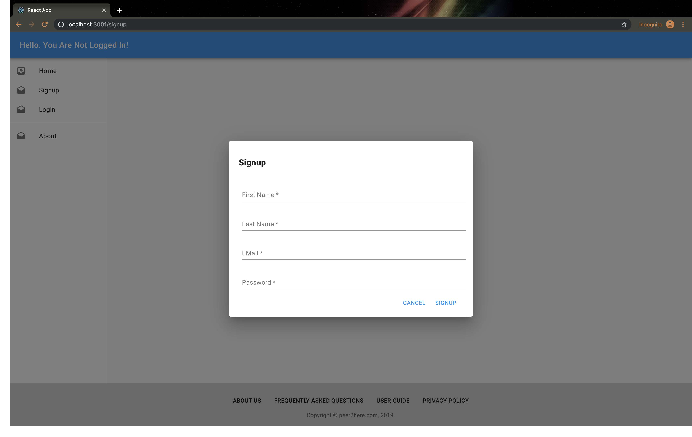
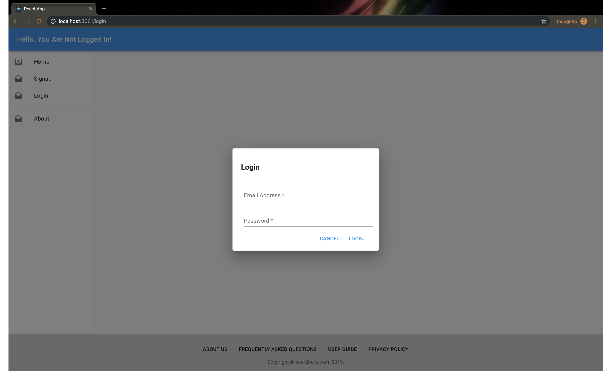

# Overview
Found yourself wishing you knew how to do something but didn't know where to start? Ever thought, "If I just had someone to help me and mentor me through this"? Or have you ever had a skill you wish you could teach someone else? Peer2Here is the site for you! The site where you can find a mentor or mentee for all those "I wish" ideas. No more of that "wishing" mentality, get connected NOW!

# Technologies Used

# Our Approach
Our initial step was to brainstorm ideas that would meet the requirements but still have applicable sense. We came to Peer2Here, a meetup resource where you can search for a topic and find a list of other members who are either willing to mentor  or are also interested in the same topic.

From there, our next step was to build a Trello board, where we listed Necessary Deliverables and User Stories needed. Then we were able to divide the team into building the server side and a user on the front side, which would allow us to be able to manipulate the user with the pre-determined scenarios. Once that was functional, we further divided the team into back-end/front-end/styling fronts. One of our core tenets was to have a "Mobile First" mentality, so we put our best engineer on Material-UI, which was a very challenging component to implement. He was up to the task, and with some styling examples in place, the rest of the team was able to rotate through the roles after Day Three, giving each team member the best opportunity to not only fully contribute to the team on all facets, but to gain the necessary educational component of the project: full-stack immersion, and the ability to focus on the weaker knowledge points, respectively.

# Installation Instructions
- cd server && npm install && nodemon
- cd client && npm install && npm start

# Link to your user stories and wireframes
Please see our Trello Boards for User Stories and Wireframes
https://trello.com/b/VqYG8ZgR/project-3

# Descriptions of any Unsolved Problems or Major Hurdles 
In addition to rudimentery registration/login functionality, we defined two features as our MVP:
- Tags and tag search.
- In application messaging.

Sending a message is functional, however receiving or replying to a message is incomplete.
Adding tags to a profile, as a Mentor or Mentee, is functional. Searching tags works well, including partial search (regex), however, searching in a case insensitive way is not complete. 

In addition to the MVP, we focused on building out profile and a mobile first styling.

