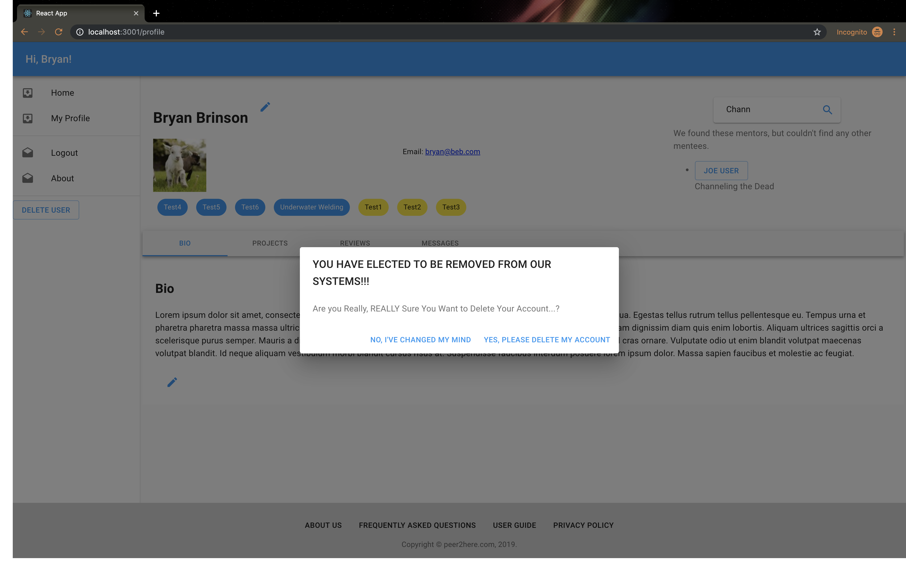

# Overview
Found yourself wishing you knew how to do something but didn't know where to start? Ever thought, "If I just had someone to help me and mentor me through this"? Or have you ever had a skill you wish you could teach someone else? Peer2Here is the site for you! The site where you can find a mentor or mentee for all those "I wish" ideas. No more of that "wishing" mentality, get connected NOW!

# Technologies Used

# General Approach

# Installation Instructions
- cd server && npm install && nodemon
- cd client && npm install && npm start

# Link to your user stories and wireframes
Please see our Trello Boards for User Stories and Wireframes
https://trello.com/b/VqYG8ZgR/project-3

# Descriptions of any Unsolved Problems or Major Hurdles 

